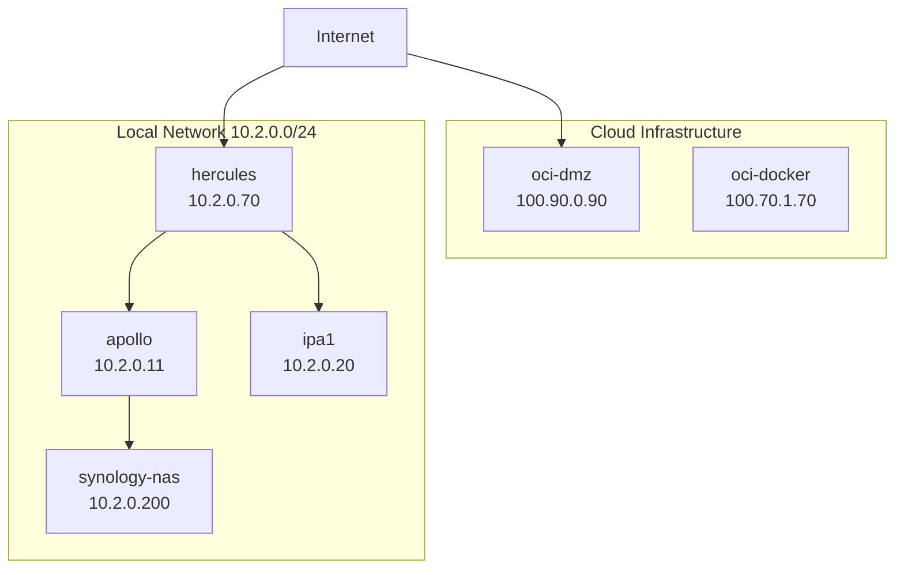

# Network Overview

## Network Architecture

This document provides an overview of the homelab network infrastructure.

### Network Segments

#### Management Network (10.2.0.0/24)
- Primary management and internal services network
- Contains most homelab infrastructure

#### DMZ Network (100.90.0.0/24)
- Public-facing services
- Oracle Cloud DMZ instance

#### Application Network (100.70.0.0/24)
- Application services
- Oracle Cloud ARM64 instance

### Key Services

| Host | IP Address | Role | Services |
|------|------------|------|----------|
| hercules | 10.2.0.70 | Primary AMD64 node | Komodo Core, shared services |
| apollo | 10.2.0.11 | Monitoring hub | Monitoring, tunnel services |
| ipa1 | 10.2.0.20 | Authentication | FreeIPA, LDAP services |
| oci-dmz | 100.90.0.90 | DMZ instance | Public-facing services |
| oci-docker | 100.70.1.70 | Application node | ARM64 applications |

### DNS Configuration

- Internal domain: `int.badger-dev.com`
- DNS server: IPA1 (10.2.0.20)

### Network Diagram

---

*Related pages: [[Service Inventory]], [[Security Configuration]]*