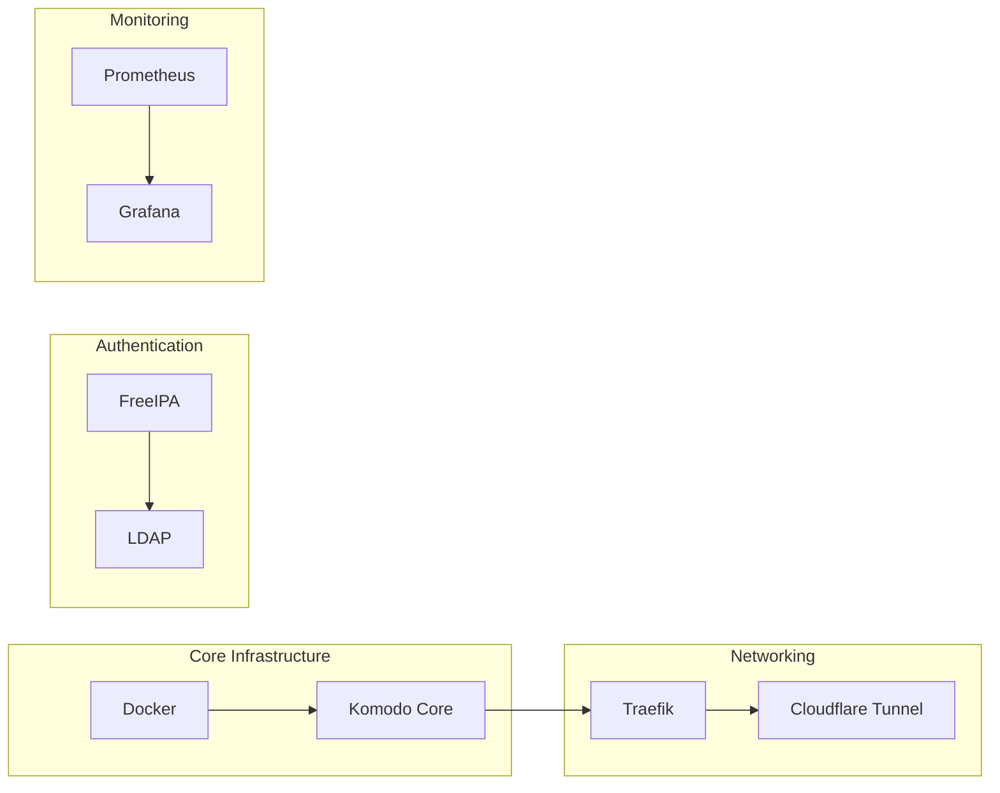

# Service Inventory

## Overview

This document catalogs all services running in the homelab infrastructure.

## Infrastructure Services

### Container Orchestration
- **Komodo Core**: Primary deployment and management system
- **Docker**: Container runtime
- **Docker Compose**: Multi-container application orchestration

### Authentication & Identity
- **FreeIPA**: Centralized authentication and LDAP services
- **LDAP**: Directory services for application integration

### Monitoring & Observability
- **Prometheus**: Metrics collection and storage
- **Grafana**: Visualization and dashboards
- **AlertManager**: Alert routing and notification

### Networking & Reverse Proxy
- **Traefik**: Reverse proxy and load balancer
- **Cloudflare Tunnel**: Secure external access

## Application Services

### Development & Automation
- **Git**: Version control
- **CI/CD Pipelines**: Automated deployment
- **Ansible**: Configuration management

### Documentation & Knowledge Management
- **Obsidian**: Documentation and note-taking
- **Wiki**: Internal knowledge base

### Storage & Backup
- **Kopia**: Snapshot-based backup system
- **NFS**: Network file storage
- **Synology NAS**: Primary storage solution

## Service Status Dashboard

| Service | Host | Status | Last Updated | Notes |
|---------|------|--------|--------------|-------|
| Komodo Core | hercules | 🟢 Running | $(date) | Version latest |
| Traefik | hercules | 🟢 Running | $(date) | SSL configured |
| FreeIPA | ipa1 | 🟢 Running | $(date) | LDAP active |
| Prometheus | apollo | 🟢 Running | $(date) | Scraping enabled |
| Grafana | apollo | 🟢 Running | $(date) | Dashboards configured |

## Service Dependencies

---

*Related pages: [[Network Overview]], [[Monitoring Setup]]*